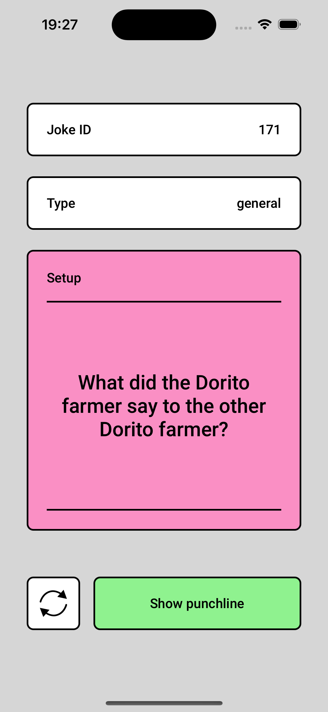
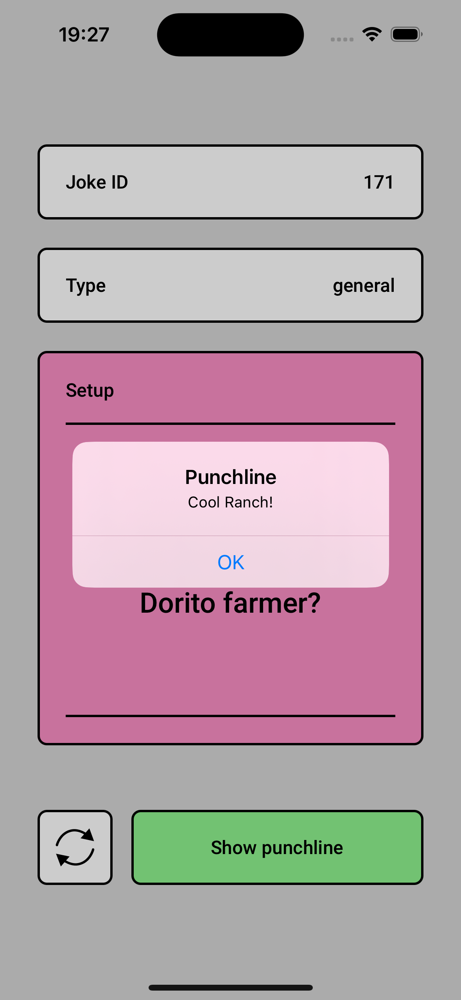

# Jokes App

Welcome to the Jokes App! This is a simple and fun mobile application designed to deliver random jokes to users. The app presents a setup line, and users can try to guess the punchline or reveal it with a tap. Enjoy a good laugh with a variety of general humor!

## Description

The Jokes App is built to provide a lighthearted experience. It features a clean interface where users are presented with a joke setup and can either guess the punchline or click to reveal it. The app includes a variety of jokes categorized under "general" humor, with a playful twist like the example featuring "Dorito farmers."

## Features
- Displays random jokes with a setup and punchline format.
- Option to reveal the punchline with a single tap.
- Simple and intuitive user interface.
- Categorized joke types.

## **Links**
[Figma Design](https://www.figma.com/design/LZR5TpBT49pkx0MXcBvP9U/ui-jokes-app?node-id=21-34&t=FGkuWEdZc6kiwiMJ-0)

[API](https://official-joke-api.appspot.com/jokes/random)

## **Preview**

  
  

